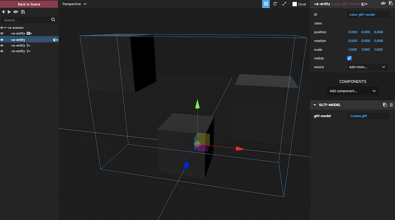
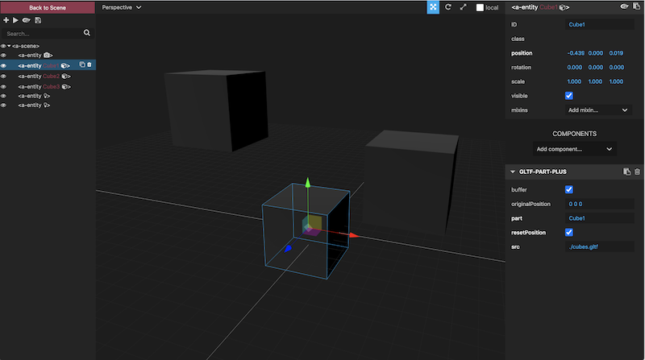
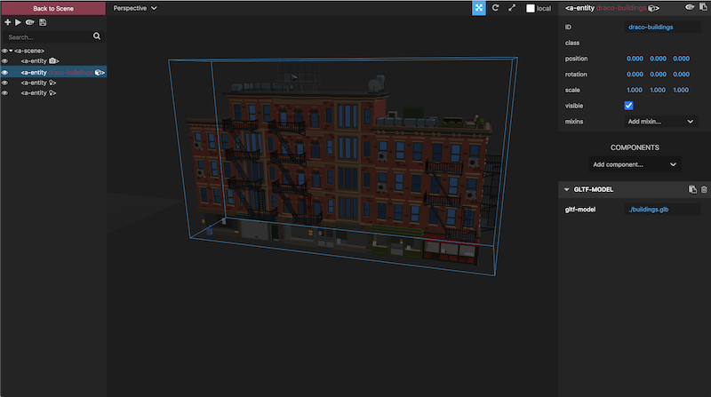
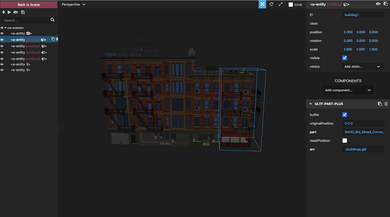

# aframe-gltf-helpers

[](https://npmjs.org/package/aframe-gltf-helpers)
[](https://npmjs.org/package/aframe-gltf-helpers)

[A-Frame](https://aframe.io) glTF Helper Components

`gltf-part-plus` component adds a few features to the original [gltf-part component](https://github.com/supermedium/superframe/tree/master/components/gltf-part) made by [@ngokevin](github.com/ngokevin), namely: draco compression and ability to extract gltf translation to the A-Frame scene graph. Note: to enable draco decompression, [refer to A-Frame instructions here](https://aframe.io/docs/1.0.0/components/gltf-model.html#geometry-compression-with-draco), also shown in examples 3 and 4 below.

`model-center` component centers the geometry of a mesh loaded from gltf-part-plus with an option to bottom align at ground level, useful for buildings, trees, etc.

These are part of an experimental glTF workflow for handling assets related to [Streetmix3D](https://github.com/kfarr/streetmix3d).

## API

### gltf-part-plus
| Property | Description | Default Value |
| -------- | -----------                                                                                                                        | ------------- |
| buffer   | Whether to load the geometry as a BufferGeometry (versus Geometry). Set to `false` if we need access to vertices, faces, UVs, etc. | true          |
| part     | Name of the part to look for specified in the glTF file as `name="<NAME>"`.                                                       | ''            |
| src      | Path to the glTF file (or selector to `<a-asset-item>`).                                                                           | ''            |
| resetPosition | copies the gltf translation to the a-frame element and resets the gltf translation | false |

### model-center
| Property | Description | Default Value |
| -------- | -----------                                                                                                                        | ------------- |
| bottomAlign   | Whether to align the bottom of the centered mesh geometry with the ground or floor level (at `y=0`), useful for buildings, trees or other set dressings | false |

## Examples
Press `<ctrl> + <alt> + <i>` once scene is loaded to inspect individual gltf-part entities
* [01 - Cube Model using normal A-Frame glTF Loader ("control" case) ](https://kfarr.github.io/aframe-gltf-helpers/examples/01-cube-gltf-model.html)
* [02 - Cube Model using gltf-part-plus component, translating cube positions from gltf to A-Frame scene graph ](https://kfarr.github.io/aframe-gltf-helpers/examples/02-cube-gltf-part.html)
* [03 - glTF Model with draco compression loaded using built-in A-Frame glTF model loader (draco "control" case) ](https://kfarr.github.io/aframe-gltf-helpers/examples/03-draco-gltf-model.html)
* [04 - glTF Model with draco compression loaded using gltf-part-plus component ](https://kfarr.github.io/aframe-gltf-helpers/examples/04-draco-gltf-part.html)

### Installation

#### Browser

Install and use by directly including the [browser files](dist):

```html
<head>
  <title>My A-Frame Scene</title>
  <script src="https://aframe.io/releases/1.0.4/aframe.min.js"></script>
  <script src="https://unpkg.com/aframe-gltf-helpers@0.0.1/dist/aframe-gltf-helpers.min.js"></script>
</head>

<body>
  <a-scene>
    <a-entity gltf-part-plus="src: #draco-buildings-model; part: SM3D_Bld_Mixed_Corner_4fl;" model-center></a-entity>
  </a-scene>
</body>
```

#### npm

Install via npm:

```bash
npm install aframe-gltf-helpers
```

Then require and use.

```js
require('aframe');
require('aframe-gltf-helpers');
```
