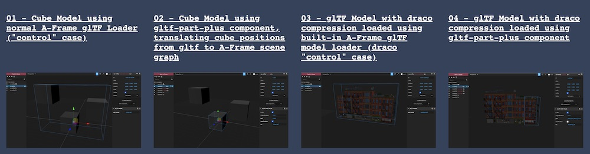

# aframe-gltf-helpers

[](https://npmjs.org/package/aframe-gltf-helpers)
[](https://npmjs.org/package/aframe-gltf-helpers)

[A-Frame](https://aframe.io) glTF Helper Components

`gltf-part-plus` component adds a few features to the original [gltf-part component](https://github.com/supermedium/superframe/tree/master/components/gltf-part) made by [@ngokevin](github.com/ngokevin), namely: draco compression and ability to extract gltf translation to the A-Frame scene graph. Note: to enable draco decompression, [refer to A-Frame instructions here](https://aframe.io/docs/1.0.0/components/gltf-model.html#geometry-compression-with-draco), also shown in examples 3 and 4 below.

`model-center` component centers the geometry of a mesh loaded from gltf-part-plus with an option to bottom align at ground level, useful for buildings, trees, etc.

These are part of an experimental glTF workflow for handling assets related to [Streetmix3D](https://github.com/kfarr/streetmix3d). See below for more info on the full workflow.

## API

### gltf-part-plus
| Property | Description | Default Value |
| -------- | -----------                                                                                                                        | ------------- |
| buffer   | Whether to load the geometry as a BufferGeometry (versus Geometry). Set to `false` if we need access to vertices, faces, UVs, etc. | true          |
| part     | Name of the part to look for specified in the glTF file as `name="<NAME>"`.                                                       | ''            |
| src      | Path to the glTF file (or selector to `<a-asset-item>`).                                                                           | ''            |
| resetPosition | For the first gltf node encountered in the matching `part`, copy its translation to the a-frame entity, and then set gltf translation to `0 0 0`. This keeps the same world position for the placed gltf `part`'s first node, while giving the A-Frame entity the value of that part from the gltf scene. However, this only works for a simple gltf with only 1 child node for each `part` in the scene. (Use with caution, this is not a well-tested property and [might not work as expected](https://github.com/kfarr/aframe-gltf-helpers/issues/1) on your model.) | false |

### model-center
[Center](https://threejs.org/docs/#api/en/core/Geometry.center) the child geometry of the current entity's object3d.
| Property | Description | Default Value |
| -------- | -----------                                                                                                                        | ------------- |
| bottomAlign   | Whether to align the bottom of the centered mesh geometry with the ground or floor level (at `y=0`), useful for buildings, trees or other set dressings | false |

### anisotropy
Traverse through materials in a glTF model to set anisotropic filtering value. This component only accepts one optional number value.
| Attribute Type | Description | Default Value |
| -------- | -----------                                                                                                                        | ------------- |
| `number`   | Desired [anisotropy value](https://threejs.org/docs/#api/en/textures/Texture.anisotropy) for all texture maps found while traversing the model. Setting to 0 (default) will set the value to the maximum value supported by hardware. | 0 |


## Examples
For each example, press `<ctrl> + <alt> + <i>` once scene is loaded to inspect individual gltf-part entities as a "manual test".

### [CLICK FOR ONLINE EXAMPLES ](https://kfarr.github.io/aframe-gltf-helpers/)


### Installation

#### Browser

Install and use by directly including the [browser files](dist):

```html
<head>
  <title>My A-Frame Scene</title>
  <script src="https://aframe.io/releases/1.2.0/aframe.min.js"></script>
  <script src="https://unpkg.com/aframe-gltf-helpers@0.0.5/dist/aframe-gltf-helpers.min.js"></script>
</head>

<body>
  <a-scene>
    <a-entity gltf-part-plus="src: #draco-buildings-model; part: SM3D_Bld_Mixed_Corner_4fl;" model-center anisotropy></a-entity>
  </a-scene>
</body>
```

#### npm

Install via npm:

```bash
npm install aframe-gltf-helpers
```

Then require and use.

```js
require('aframe');
require('aframe-gltf-helpers');
```

### About the Example Models
* The [cubes.gltf model](https://github.com/kfarr/aframe-gltf-helpers/blob/master/examples/cubes.gltf) has 3 cubes translated to arbitrary locations within a few units of 0 0 0 with no rotation. MIT License.
* The [buildings.glb model](https://github.com/kfarr/aframe-gltf-helpers/blob/master/examples/buildings.glb) has 5 buildings with "applied" custom translations applied in Blender, then exported as a glb with draco compression. The buildings are paid models from the [Synty Polygon City Pack](https://syntystore.com/products/polygon-city-pack) for use in Streetmix3D and are for testing only. Please purchase a license for $19.99 from them if you use these models in your own projects.
* [Meshopt gltf pack](https://github.com/zeux/meshoptimizer/blob/master/gltf/README.md) output of the same buildings model as 3 files:
`gltfpack -kn -i ./scenesmall3.gltf -o buildings-gltfpackkn.glb`
`gltfpack -c -kn -i ./scenesmall3.gltf -o buildings-gltfpackckn.glb`
`gltfpack -cc -kn -i ./scenesmall3.gltf -o buildings-gltfpack-cc-kn.glb`
* [New Flyer XD40 Bus Model](https://github.com/kfarr/aframe-gltf-helpers/blob/master/examples/XD40.glb) Credits: [New Flyer XD40 Bus](https://sketchfab.com/3d-models/new-flyer-xd40-d61e475543324d21aa24b2b208fbf3c5) |

### About the Workflow
These are part of an experimental glTF workflow for handling assets related to [Streetmix3D](https://github.com/kfarr/streetmix3d). 

The current workflow is roughly:
- "Main" Blender file for a collection of models that share the same material such as "urban buildings", "suburban buildings", "plants and trees", "vehicles", etc. (Only 1 material keep things simple at first, future support for more.)
- Export to a gltf with separate bin and image files (some separate gltf files may share the same image, I don't see a need to combine to one glb). Enable Draco mesh compression.
- Use this repo's `gltf-part-plus` component to load part from draco compressed file.

Alternate workflow (not working):
- Use the Main Blender file to export a gltf *without* draco compression.
- Use [meshopt gltfpack](https://github.com/zeux/meshoptimizer/blob/master/gltf/README.md) with compression such as `gltfpack -cc -kn -i ./scenesmall3.gltf -o buildings-gltfpack-cc-kn.glb` to optimize and compress
- Or use [meshopt gltfpack](https://github.com/zeux/meshoptimizer/blob/master/gltf/README.md) *without* such as `gltfpack -kn -i ./scenesmall3.gltf -o buildings-gltfpack-kn.glb` and serve with a web host that automatically gzip compresses ([not github pages](https://github.community/t/support-for-gzip-on-glb-3d-model-files/11004) at the moment)

### Wishlist

I'd like to add:
* ability to support meshopt gltfpack with -c option, similar in spirit to draco support
* automated testing for each example
* instancing
